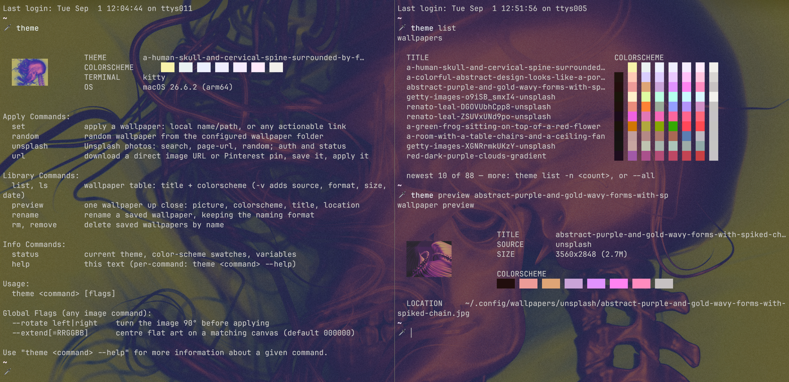

# theme

[](https://github.com/snaraj/theme/actions/workflows/ci.yml)
[](https://github.com/snaraj/theme/releases)
[](LICENSE)

Manage your wallpapers and the aesthetics of your Desktop and Terminal using
the background image as the driver.



## Install

Prebuilt binaries for macOS and Linux ship on the
[releases page](https://github.com/snaraj/theme/releases), each release with
a `SHA256SUMS` to verify against.

**macOS**

```sh
curl -fsSLO https://github.com/snaraj/theme/releases/latest/download/theme-aarch64-apple-darwin.tar.gz
tar -xzf theme-aarch64-apple-darwin.tar.gz
mkdir -p ~/.local/bin && mv theme ~/.local/bin/
```

**Linux**

```sh
curl -fsSLO https://github.com/snaraj/theme/releases/latest/download/theme-x86_64-unknown-linux-gnu.tar.gz
tar -xzf theme-x86_64-unknown-linux-gnu.tar.gz
mkdir -p ~/.local/bin && mv theme ~/.local/bin/
```

- Intel Mac: `theme-x86_64-apple-darwin.tar.gz` · ARM Linux:
  `theme-aarch64-unknown-linux-gnu.tar.gz`
- `~/.local/bin` must be on your `PATH`.
- Or build from source: `cargo build --release`.

### Compatibility

| Platform | glibc | Prebuilt binary | From source |
| --- | --- | --- | --- |
| macOS (Apple Silicon, Intel) | — | yes | yes |
| Ubuntu 24.04 | 2.39 | yes | yes |
| Fedora 44 | 2.43 | yes | yes |
| Arch | 2.44 | yes | yes |
| Debian 12 | 2.36 | no | yes |
| Ubuntu 22.04 | 2.35 | no | yes |
| Alpine 3 (musl) | — | no | yes |

The prebuilt Linux binaries inherit the glibc floor of the runner that
builds them — 2.39 today — so a distribution below that line builds from
source, as musl systems do. Every Linux row was checked on 2026-09-03 in a
container on x86_64 and arm64 (Arch on x86_64, the only architecture it
publishes an image for): the release tarball for the prebuilt column, a
source build and the whole `tests/boundary.sh` fixture for the other.
`tests/linux-matrix.sh` re-runs the prebuilt half against the current
release.

## Use

`theme help` is the reference. In brief:

```
theme random | set <name|link> | unsplash [query|page-url] | get <link>
theme list | search <terms> | preview [-w] <name> | status | update | version | rename | rm
```

`--rotate left|right`, `--extend[=hex]`, and `--desktop-only` (wallpaper
without recoloring the terminal) are accepted anywhere; `--mkdir <folder>`
files a `get` download under a library subfolder of your own.

macOS 14 and later keep a wallpaper per Mission Control Space, and the system
tools change only the Space you are looking at. `theme` applies the image to
every Space on every display and seeds the all-Spaces fallback, so Spaces you
create later inherit it too. Your screensaver choices are left alone.

## Terminals

- **kitty** — recolored live over its remote-control socket; future windows
  pick the palette up from `current-theme.conf`.
- **alacritty** — a managed `theme-colors.toml` is written under
  `~/.config/alacritty/`; import it once and alacritty live-reloads on every
  theme change.
- **anything else** — standard OSC 4/10/11/12 color sequences to the calling
  terminal.

## Environment

- `THEME_WALLPAPER_DIR` — the wallpaper library; a colon-separated list is
  allowed (every directory searched, downloads land in the first).
- `THEME_CACHE_DIR` — palette cache root (default `~/.cache/theme`).
- `THEME_CONTRAST` — minimum text-to-background contrast floor.
- `THEME_NO_APPLY` — dry-run: announce what would happen, touch nothing.
- `THEME_NO_UPDATE_CHECK` — disable the update-available note on the bare
  `theme` screen. The check asks GitHub for the latest release tag at most
  once every 24 hours (2-second cap, silent on failure, nothing sent but
  the request itself), cached under `THEME_CACHE_DIR`; the explicit
  `theme update` installs it and is never disabled by this. The cache is
  only used while every directory on its path is owned by you and free of
  write-granting ACLs — a cache you have deliberately ACL'd open is out of
  contract and the check silently stands down.
- `UNSPLASH_ACCESS_KEY` / `UNSPLASH_SECRET_KEY` / `UNSPLASH_USER_TOKEN` —
  Unsplash credentials (the macOS Keychain is consulted when unset; no
  credential ever appears on an argv).

## Build and test

```sh
cargo build --release            # target/release/theme
cargo test                       # unit + trust-boundary tests
tests/boundary.sh                # the acceptance fixture (headless)
```
